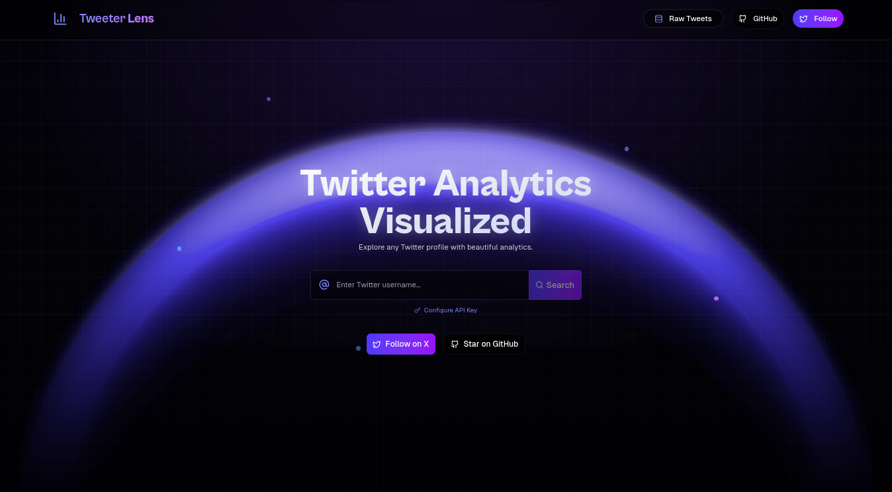

# TweeterLens 🔍



TweeterLens is a powerful Twitter analytics and visualization tool that helps you explore and analyze any Twitter profile with beautiful, interactive dashboards. Get detailed insights into posting patterns, engagement metrics, and content performance.

[](https://vercel.com/new/clone?repository-url=https%3A%2F%2Fgithub.com%2FUtkarshTheDev%2FTweeterLens)
[](https://twitter.com/UtkarshTheDev)

## ✨ Features

- **Profile Analysis**: Enter any Twitter username to analyze their posting history and engagement patterns
- **Detailed Analytics**: View engagement metrics, hashtag usage, and interactive heatmaps of activity patterns
- **GitHub-Style Contribution Graph**: Visualize posting frequency with a beautiful contribution heatmap
- **Engagement Metrics**: Track likes, retweets, replies, and views with detailed breakdowns
- **Posting Patterns**: Discover optimal posting times and consistency metrics
- **Fast & Efficient**: Smart caching and optimized data fetching for quick results
- **Shareable Stats**: Copy and download visualizations to share on social media
- **Server-Side Rendering**: Optimized performance with Next.js SSR

## 🚀 Live Demo

Check out the live demo at [https://tweeterlens.vercel.app](https://tweeterlens.vercel.app)

## 📊 Analytics Features

TweeterLens provides comprehensive analytics including:

- Posting consistency and streaks
- Engagement efficiency metrics
- Optimal posting time analysis
- Content performance insights
- Conversation metrics
- Twitter personality type
- Viral tweet identification
- Source analysis (which apps are used for tweeting)

## 🛠️ Tech Stack

- **Framework**: [Next.js 15](https://nextjs.org/)
- **Styling**: [Tailwind CSS](https://tailwindcss.com/)
- **UI Components**: [Shadcn UI](https://ui.shadcn.com/)
- **State Management**: [TanStack Query](https://tanstack.com/query)
- **Animation**: [Framer Motion](https://www.framer.com/motion/)
- **Data Fetching**: [Social Data API](https://socialdata.tools)
- **Caching**: [Upstash Redis](https://upstash.com/)
- **Deployment**: [Vercel](https://vercel.com)

## 🔧 Getting Started

### Prerequisites

- [Node.js](https://nodejs.org/) (v18 or newer)
- [Bun](https://bun.sh/) (recommended) or npm/yarn
- [Social Data API](https://socialdata.tools) key

### Installation

1. Clone the repository:

   ```bash
   git clone https://github.com/UtkarshTheDev/TweeterLens.git
   cd TweeterLens
   ```

2. Install dependencies:

   ```bash
   bun install
   # or
   npm install
   ```

3. Create a `.env.local` file in the root directory with the following variables:

   ```
   UPSTASH_REDIS_REST_URL=your_upstash_redis_url
   UPSTASH_REDIS_REST_TOKEN=your_upstash_redis_token
   ```

4. Start the development server:

   ```bash
   bun dev
   # or
   npm run dev
   ```

5. Open [http://localhost:3000](http://localhost:3000) in your browser to see the application.

## 🔑 Getting Your Social Data API Key

TweeterLens uses the Social Data API to fetch Twitter data. Here's how to get your API key:

1. Visit [SocialData.tools](https://socialdata.tools) and sign up for a free account
2. Navigate to **Dashboard → API Keys**
3. Copy your API key
4. Paste it in the API key input field in the TweeterLens app

### Important Notes About API Credits

- **Free tier**: The Social Data API provides a limited number of free credits
- **Credit calculation**: The API provides 1000 tweets for $0.20
- **For accounts with 250+ tweets**: You may need additional credits. Contact SocialData.tools support and request additional credits based on your tweet count
- **Request formula**: Request `(Your total tweets ÷ 1000) × $0.20` in credits
- **Best for small creators**: TweeterLens works best for accounts with 250-1000 tweets. For larger accounts, consider using Twitter Analytics if you can't get additional credits

## 📝 Usage Tips

1. **Enter a Twitter username** in the search box
2. **Configure your API key** if prompted
3. **Explore the analytics dashboard** with various metrics and visualizations
4. **Share insights** by copying or downloading the visualizations
5. **Switch between years** to analyze posting patterns over time

## 🔄 Caching Behavior

TweeterLens implements smart caching to minimize API calls:

- Twitter profiles are cached for 8 hours
- Tweets are cached for 8 hours
- Tweet stats are cached for 8 hours
- The app will show cached data when available and only fetch fresh data when necessary

## 🤝 Contributing

Contributions are welcome! Please feel free to submit a Pull Request.

1. Fork the repository
2. Create your feature branch (`git checkout -b feature/amazing-feature`)
3. Commit your changes (`git commit -m 'Add some amazing feature'`)
4. Push to the branch (`git push origin feature/amazing-feature`)
5. Open a Pull Request

## 📄 License

This project is licensed under the MIT License - see the [LICENSE](LICENSE) file for details.

## 🙏 Acknowledgements

- [Social Data API](https://socialdata.tools) for providing Twitter data access
- [Shadcn UI](https://ui.shadcn.com/) for the beautiful UI components
- [Vercel](https://vercel.com) for hosting and deployment
- [Next.js](https://nextjs.org/) for the amazing React framework

## 📧 Contact

- Twitter: [@UtkarshTheDev](https://twitter.com/UtkarshTheDev)
- GitHub: [UtkarshTheDev](https://github.com/UtkarshTheDev)

---

Built with ❤️ by [Utkarsh](https://twitter.com/UtkarshTheDev)
